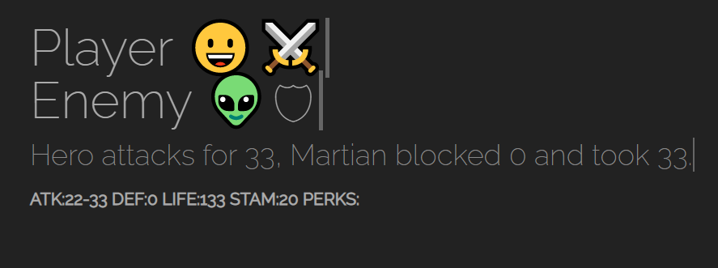

---
# Feel free to add content and custom Front Matter to this file.
# To modify the layout, see https://jekyllrb.com/docs/themes/#overriding-theme-defaults
layout: home
---

## Our projects

 

  
  

    <h4><b>FitRogue</b></h4>
    
Your health in an emoji rogue-like adventure

  

 

  
  

    <h4><b>Funin</b></h4>
    
Share creative ideas of having fun indoors while working remotely

  

 

  
  

    <h4><b>NoStress</b></h4>
    
Prevent stress before it becomes serious

  

