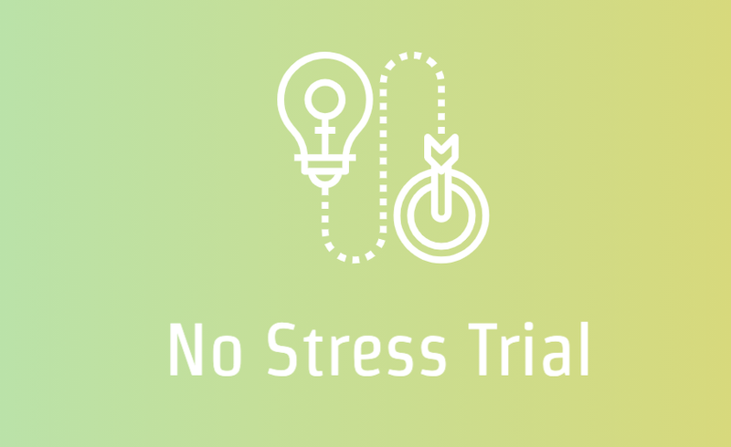
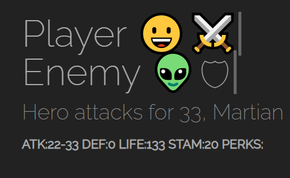
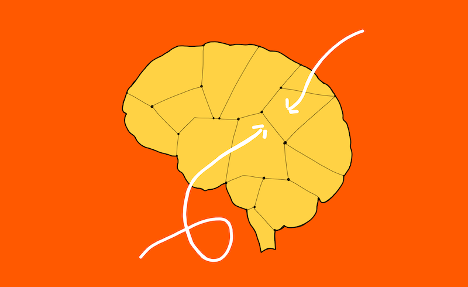
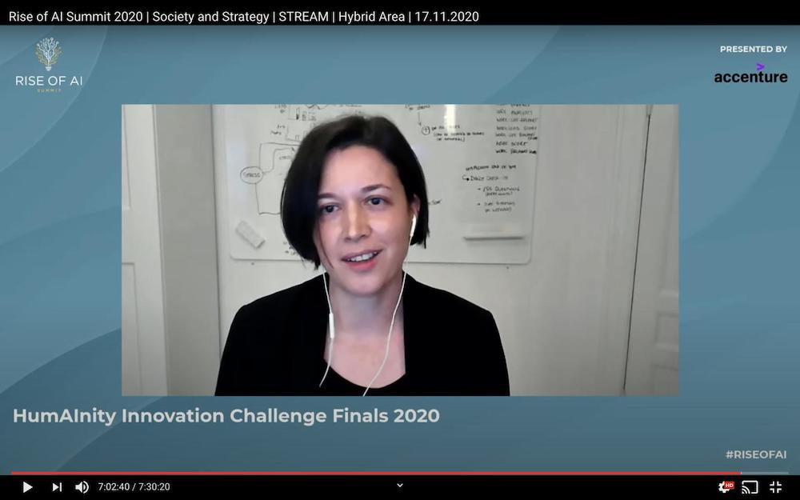

<h1 style="text-align:center; font-size: 35px;">Healthy Mind Tech is a start-up organization with the vision of improving people’s lives through technology.</h1>

 

Here are some of our projects:

 

  

    

      
      

        <h4><b>NoStressTrial</b></h4>
        
A platform for planning, running and reporting on clinical trials

      

    

  

  

    

      
      

        <h4><b>FitRogue</b></h4>
        
Your health in an emoji rogue-like adventure

      

    

  

  

    

      
      

        <h4><b>Funin</b></h4>
        
Share creative ideas of having fun indoors while working remotely

      

    

  

  

    

      
      

        <h4><b>NoStress</b></h4>
        
Prevent stress before it becomes serious

      

    

  

